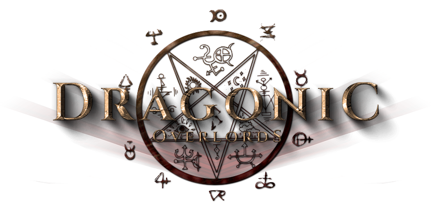

# Welcome to Dragon World!

Dear our valued Players/Users/Investors!

Welcome to the fantasy world of Dragonic, where you can enjoy a novelistic gaming experience and earn money simultaneously!

Our game development team has over 15 years of experience creating world-class games with stunning visual and addictive gameplay. Over the years, we've been thinking about how to bring more value to the players of our games. We can now realize that goal thanks to blockchain technology and, in particular, NFT technology. By tokenizing our in-game characters and items into NFTs and creating a market for them, we can now bring those items real-life value from which our users can benefit. 

Our ambition is to build a top NFTs ecosystem in the blockchain space that delivers sustainable value to our users and investors. The comprehensive ecosystem comprises Dragonic - The lucrative NFT fantasy-themed RPG game on BSC, high liquidity NFT Marketplace, world-class collectibles, and Dragonic community. 

Kindly read through our white paper and discover fantastic earning opportunities from Dragonic!

And finally, thank you for being a part of the Dragonic community!

_Dragonic team,_

